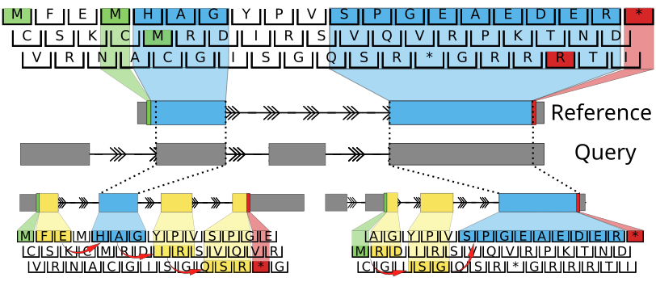

.. ORFan documentation master file, created by
   sphinx-quickstart on Sat May 13 21:50:29 2023.
   You can adapt this file completely to your liking, but it should at least
   contain the root `toctree` directive.

ORFanage: By-reference ORF annotation
=================================
    
.. image:: https://img.shields.io/badge/License-GPLv3-blue.svg
    :target: https://www.gnu.org/licenses/gpl-3.0
    :alt: GPLv3 License
    
.. image:: https://img.shields.io/github/v/tag/alevar/orfanage?style=flat-square
	:target: https://img.shields.io/github/v/tag/alevar/orfanage?style=flat-square
	:alt: GitHub tag (latest SemVer)
    
**ORFanage** is an ultra-efficient pseudo-alignment algorithm for annotating ORFs by maximizing similarity to reference proteins.

-------------------

**Example**

	For each overlap **ORFanage** extends coordinates towards the 3’ and 5’ ends based on suitable parameters. 

.. code-block:: console
	
	$ orfanage --reference genome.fasta --output output.gtf \
		--query query.gtf reference.gtf

**ORFanage** allows users to rapidly search and find ORFs on query transcripts.
Users may apply the method to their experimental datasets to:

- Search for likely coding transcripts
- Discover novel protein variants
- Identify and quantify AS events involved in any observed changes to the protein sequnces
- Much more

The method can also be applied to correct available protein annotations at loci with additional reference data.

The User Guide
--------------

.. toctree::
   :maxdepth: 2

   user/install
   user/quickstart
   user/file_formats
   user/examples
   user/contact