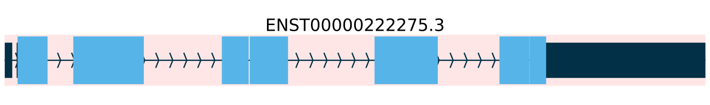
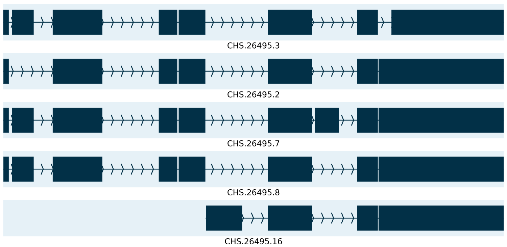
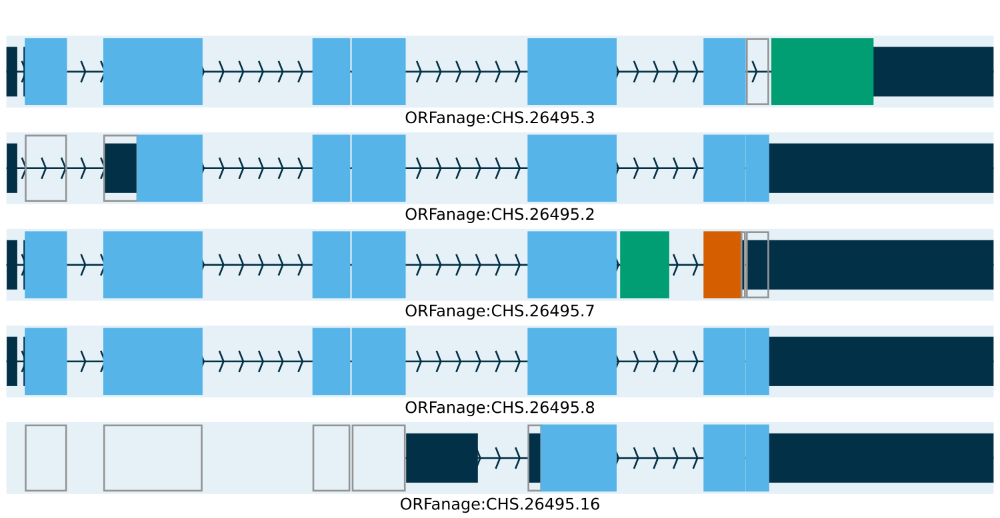
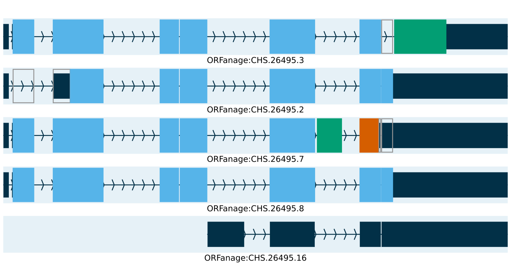

.. _examples:

Examples
======================

In this section, we will walk you through a sample workflow using ORFanage to annotate ORFs in a simple locus. 
To illustrate the process in a clear and concise way, we will use a single locus and a subset of isoforms from the CHESS dataset [#chess]_.

To run this example, you will need the GTF annotations provided in the main repository's ``examples`` directory. 
Additionally, you will need to provide a GRCh38 copy of the human reference genome to run the examples as intended.

This sample workflow serves as a helpful guide for annotating ORFs, and it can be easily adapted to suit your specific needs.

Annotating Proteins in isoforms of UPK1A
-----------------------------------------

Suppose we are interested in studying uroplakin, a cell surface protein encoded in humans by the UPK1A gene. 
The reference genome annotates only one isoform of the gene, as shown in the image below [#sashimi]_.

However, after generating RNA-seq data, assembling the reads into full-length transcripts, and filtering out noise, 
we observe 5 novel isoforms, all expressed at high levels in various tissues. 
The alternatively spliced (AS) isoforms are displayed in the image below.

Since the UPK1A gene is protein-coding, we decide to examine these novel isoforms 
to see whether various AS events are compatible with the sequence of the canonical protein 
and what changes to the protein are presented by the AS events.

To do so, we run **ORFanage** with the following command:

::

	$ orfanage --reference genome.fa --query examples/query.gtf --output examples/orfanage.gtf --stats examples.orfanage.stats.tsv examples/template.gtf

This command analyzes the novel isoforms and annotates possible ORFs. The resulting CDS regions are displayed in the image below.

After examining the ILPI score distribution in the stats output file, we notice that 
some proteins are very short and dissimilar from the reference. We think these may be non-coding isoforms 
and wish to remove CDS annotations from them. To do so, we re-run the analysis with appropriate filters using the following command:

::

	$ orfanage --ilpi 60 --reference genome.fa --query examples/query.gtf --output examples/orfanage.gtf examples/template.gtf

The resulting annotated transcripts, with CDS annotations removed from non-coding isoforms, are shown in the image below.

And that's it! With **ORFanage**, we were able to annotate the desired transcripts and better understand the AS events of the UPK1A gene.

References
--------------

.. [#chess] `CHESS 3: an improved, comprehensive catalog of human genes and transcripts based on large-scale expression data, phylogenetic analysis, and protein structure <https://www.biorxiv.org/content/10.1101/2022.12.21.521274v1>`__. 
.. [#sashimi] `Sashimi plots <https://github.com/alevar/tiebrush>`__. 